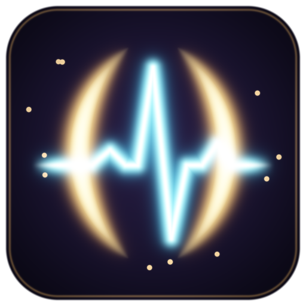
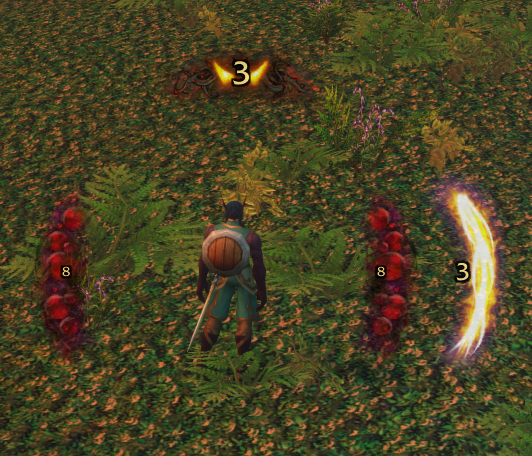
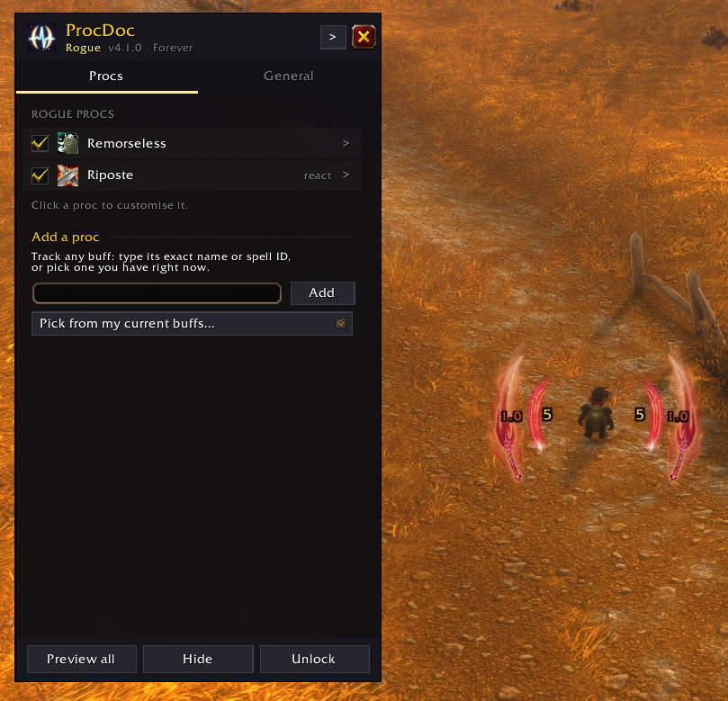
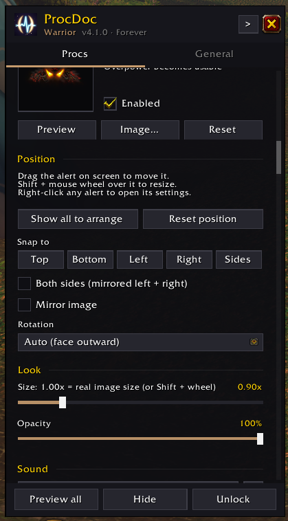

  

<h1 align="center">ProcDoc</h1>

<b>Never miss a proc again.</b> Big, pulsing proc alerts for World of Warcraft: Forever.

---

**ProcDoc** is a lightweight addon for **World of Warcraft: Forever**. It shows big pulsing visuals the moment you get a proc worth reacting to (Clearcasting, Shadow Trance, Overpower, Riposte and so on), so you never miss one.

It works out of the box: install it and procs light up. When you want to, every alert can be arranged and styled right on screen with the mouse.

## Screenshots

  

<i>Alerts in combat, each with its own countdown.</i>

  
  

<i>The options window sits beside your alerts. Every proc can be placed, sized and styled.</i>

---

## Key Features

1. **Visual alerts for procs**: pulsing images around your character whenever a proc is active, with a sound and a countdown. Each alert **pops in** with a bright flash the moment the proc happens, and quickly **shrinks away** when the proc is used or runs out.
2. **Drag-and-drop layout**: with the options open, drag any alert to where you want it. **Shift + mouse wheel** over an alert resizes it. Each alert can also be shown on **both sides** of the screen as a mirrored pair.
3. **Customisable countdowns**: drag the number to any spot on its alert, and Shift + wheel over it to resize it. Choose the font, outline, colors, when it turns "running out", and whether to show tenths.
4. **Your own procs**: track any buff by name or spell ID, or pick one you have right now (in combat, pick from the buffs you had earlier). Anything the game flags with its own proc glow is also picked up automatically.
5. **Buff reminders**: set any buff to alert when it's **missing** instead, like Slice and Dice, an armor or Intellect, so you know to put it back, in or out of combat.
6. **Reaction abilities without action bars**: Overpower, Revenge, Riposte, Counterattack and Mongoose Bite light up when they become usable.
7. **Clears when used**: alerts go away as soon as the proc is spent, even in combat, where Forever hides buff details from addons.

---

## Installation

**CurseForge app (easiest):** search for **ProcDoc** and click Install. Updates arrive automatically.

**Manually:**
1. Download the latest release zip from CurseForge.
2. Unzip it so the addon sits at `World of Warcraft\_classic_beta_\Interface\AddOns\ProcDoc\`.
3. Restart the game (or `/reload` if it's already running).
4. Make sure **ProcDoc** is enabled in the AddOns list at character select.

---

## How to Use

1. **Log in** with any class.
2. **Get a proc.** The alert pulses on screen with a countdown and a sound.
3. **Customise (optional).** Click the **ProcDoc minimap button**, type **`/procdoc`** (or `/pd`), or open ProcDoc from the game's AddOns settings or the addon compartment menu.

### Minimap button

- **Left-click:** open or close the options.
- **Right-click:** show all alerts to arrange them, and right-click again when you're done.
- **Drag:** slide it around the minimap edge. It remembers where you put it.
- **Hide or show it:** use **Show minimap button** in the General tab, or `/procdoc minimap`.

### Arranging alerts

- While the options window is open, alerts on screen can be moved directly:
  - **Drag** an alert to move it.
  - **Shift + mouse wheel** over an alert to resize it.
  - **Drag the countdown number** to move it around on its alert.
  - **Shift + mouse wheel** over the number to change its size.
  - **Right-click** an alert to open its settings.
- **Show all to arrange** (or the **Unlock** button, or `/procdoc unlock`) shows every enabled alert at once, with a faint centre guide, so you can lay them out together.
- Previews stay on screen until you click **Hide** or close the window, and they run a sample countdown so you can style the timer.

### The options window

A slim panel docked near the side of the screen, so your alerts stay visible while you edit. **Drag its title bar** to put it anywhere: it remembers where you leave it, even after a reload. The header's dock button snaps it back to an edge, and **Window scale** (General tab) shrinks it for small screens.

- **Procs tab**: every proc for your class with an on/off checkbox. Click one to open its page (**<** / **>** steps through them). At the bottom, **Add a proc** tracks any buff by name, spell ID, or from your current buffs.
- **Each proc's page**:
  - **Preview**, **Image...** (any of the 69 images in `img\`, the spell icon, Blizzard's art, or your own file) and **Reset**.
  - **Position**: **Snap to** Top, Bottom, Left, Right or Sides (a mirrored left + right pair), then drag to fine-tune. Also Show all to arrange, Reset position, **Both sides**, **Mirror image**, and **Rotation**. *Auto* rotation turns the art to face outward (a snap decides which way); you can also pick 0 / 90 / 180 / 270 degrees.
  - **Look**: size (1.00x = the image's real pixel size, whatever your resolution) and opacity.
  - **Sound**: this proc's sound, or the default.
  - **Countdown**: show it or not, text size, color, on one side only (for pairs), and Reset countdown.
  - **Stacks** (buff procs): a row of dots shows how many stacks you have. Filled dots are stacks you have and dim ones are the rest; the newest dot pops when you gain a stack. Choose **Show the alert at** N stacks, the **Number of dots** (auto uses the most stacks seen), the dot color, and dots on one side only. Drag the dots on screen to move them, or Shift + wheel over them to resize. **Test stacks** plays a pretend stacking buff through the alert so you can check it all without a real one.
  - **Reaction window** length for reaction abilities.
  - **Remove from list** for your own and auto-detected procs.
- **General tab**:
  - The pulse animation, the pop-in (on/off and strength), the shrink-away when a proc ends (on/off), a **Replay animation** button, and the scale of every alert.
  - Countdown style: font, outline, size, opacity, color, "running out" color and threshold, and tenths.
  - Default sound and sound channel, auto-detect, hiding Blizzard's own proc overlay, the window scale, and the minimap button.

### Slash commands

| Command | What it does |
| --- | --- |
| `/procdoc` | Open / close the options |
| `/procdoc unlock` / `lock` | Show all alerts to arrange / stop |
| `/procdoc test` / `hide` | Preview every enabled alert for 30s / hide previews |
| `/procdoc stacktest [name]` | Play a pretend stacking buff (1 to 5 stacks, down to 3) through a proc's alert to check its stack dots |
| `/procdoc minimap` | Show / hide the minimap button |
| `/procdoc buffs` | List your current buffs with spell IDs |
| `/procdoc trace` | Record what ProcDoc sees (to diagnose a missed proc); `/reload` saves the log. `/procdoc trace show` prints the latest lines |
| `/procdoc debug` | Print Blizzard proc-overlay events, and the last skipped error |

### New ProcDoc art

Eight original images made for ProcDoc in the same glowing style, ready in the image picker:

| Image | Shape | Good for |
| --- | --- | --- |
| Frost Shards | side | Mage (frost) |
| Arcane Runes | top | Mage (arcane) |
| Fel Flame | side | Warlock |
| Shadow Wisps | side | Warlock, shadow Priest, Rogue |
| Crimson Claws | side | Rogue, Hunter, feral Druid |
| Storm Arc | top | Shaman |
| Divine Rays | top | Paladin, Priest (great for custom procs) |
| Ember Crown | top | Warrior |

They're made by `tools/procart.py` (Python with numpy, scipy and Pillow), so new themes can be added the same way. Run `tools/sync_images.py` after adding or removing any image so the picker lists exactly what's in `img\`.

### Using your own images

Drop a `.tga` (power-of-two size, e.g. 128x256 or 256x128) into `ProcDoc\img\`. Then open a proc's image picker and type the file name (e.g. `MyProc.tga`) in the custom box. Full texture paths and file IDs work too.

---

## Supported Procs

ProcDoc only alerts on **reaction** procs, meaning something just happened that you should act on. It doesn't alert on buffs you maintain or on abilities that are simply off cooldown (if you want a nudge when a maintained buff drops, add it yourself and set it to remind you when it's missing). These are the talent and ability procs built in for Forever:

| Class | Built-in procs |
| --- | --- |
| Warlock | Shadow Trance (Nightfall) |
| Mage | Clearcasting |
| Druid | Clearcasting, Nature's Grace |
| Shaman | Clearcasting (Elemental Focus), Flurry |
| Hunter | Quick Shots, Counterattack, Mongoose Bite |
| Warrior | Enrage, Overpower, Revenge |
| Rogue | Remorseless Attacks, Riposte |
| Priest / Paladin | None built in. Use auto-detect or **Add a proc** |

Anything Forever adds is caught by **auto-detect** if the game shows its own proc glow for it. Anything else can be added with **Add a proc**.

**About combat:** Forever hides your buffs from addons while you're in combat. ProcDoc still catches the procs it can see coming: **Remorseless Attacks** lights up on your killing blow (an enemy dying at the same moment the buff lands on you, so a party member's kill doesn't set it off), **Enrage** when you take a critical hit, and the reaction abilities when you dodge, parry or block. Other buff procs that start mid-fight appear as soon as combat ends, and any proc that was already up before the fight stays up until it's used or runs out.

---

## License

Feel free to use, modify, or share **ProcDoc**. A mention or credit is welcome but not required. Enjoy your new proccing visuals!
